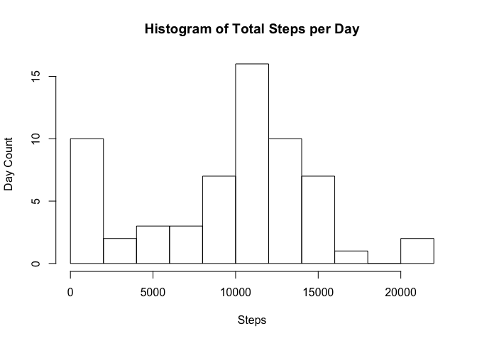
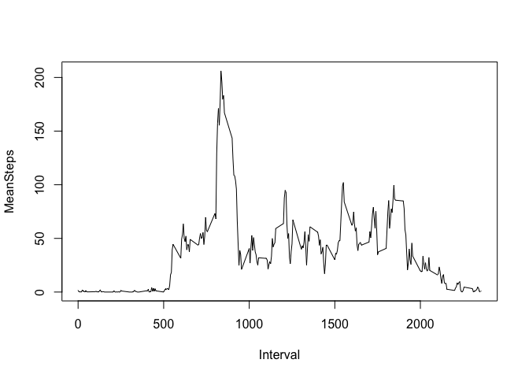
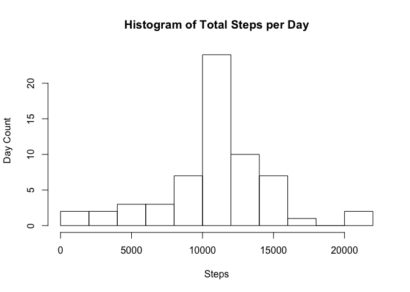

# Reproducible Research: Peer Assessment 1


## Loading and preprocessing the data


```r
#Loading activity data from CSV
activity<-read.csv(file = "activity.csv")

#Converting date from factor to date class
activity$date<-as.Date(activity$date)
activity$steps<-as.numeric(activity$steps)
activity$interval<-as.numeric(activity$interval)
```

## What is mean total number of steps taken per day?

###Daily Step Totals

```r
#Aggregating by day
daytotals<-aggregate(x=activity$steps,by=list(activity$date),FUN=sum,na.rm=T)
names(daytotals)<-c("Date","TotalSteps")
print(daytotals,row.names = F)
```

```
##        Date TotalSteps
##  2012-10-01          0
##  2012-10-02        126
##  2012-10-03      11352
##  2012-10-04      12116
##  2012-10-05      13294
##  2012-10-06      15420
##  2012-10-07      11015
##  2012-10-08          0
##  2012-10-09      12811
##  2012-10-10       9900
##  2012-10-11      10304
##  2012-10-12      17382
##  2012-10-13      12426
##  2012-10-14      15098
##  2012-10-15      10139
##  2012-10-16      15084
##  2012-10-17      13452
##  2012-10-18      10056
##  2012-10-19      11829
##  2012-10-20      10395
##  2012-10-21       8821
##  2012-10-22      13460
##  2012-10-23       8918
##  2012-10-24       8355
##  2012-10-25       2492
##  2012-10-26       6778
##  2012-10-27      10119
##  2012-10-28      11458
##  2012-10-29       5018
##  2012-10-30       9819
##  2012-10-31      15414
##  2012-11-01          0
##  2012-11-02      10600
##  2012-11-03      10571
##  2012-11-04          0
##  2012-11-05      10439
##  2012-11-06       8334
##  2012-11-07      12883
##  2012-11-08       3219
##  2012-11-09          0
##  2012-11-10          0
##  2012-11-11      12608
##  2012-11-12      10765
##  2012-11-13       7336
##  2012-11-14          0
##  2012-11-15         41
##  2012-11-16       5441
##  2012-11-17      14339
##  2012-11-18      15110
##  2012-11-19       8841
##  2012-11-20       4472
##  2012-11-21      12787
##  2012-11-22      20427
##  2012-11-23      21194
##  2012-11-24      14478
##  2012-11-25      11834
##  2012-11-26      11162
##  2012-11-27      13646
##  2012-11-28      10183
##  2012-11-29       7047
##  2012-11-30          0
```

###Histogram of the Daily Step Totals

```r
hist(daytotals$TotalSteps,main="Histogram of Total Steps per Day",xlab="Steps",ylab="Day Count",breaks=10)
```

<!-- -->

###Mean of Daily Step Totals: 9354.23 steps per day

```r
mean(daytotals$TotalSteps)
```

```
## [1] 9354.23
```

###Median of Daily Step Totals: 10395 steps per day

```r
median(daytotals$TotalSteps)
```

```
## [1] 10395
```


## What is the average daily activity pattern?

```r
intervalmeans<-aggregate(x=activity$steps,by=list(activity$interval),FUN=mean,na.rm=T)
names(intervalmeans)<-c("Interval","MeanSteps")
```

###Interval Means Time-Series

```r
#Plotting the Average Number of Steps per Interval over One Day
with(intervalmeans,plot(x = Interval,y= MeanSteps,type="l"))
```

<!-- -->

###Interval with Highest Number of Average Steps: Interval 835

```r
#Finding maximum of the interval means
intervalmeans[which.max(intervalmeans$MeanSteps),]
```

```
##     Interval MeanSteps
## 104      835  206.1698
```

##Imputing Missing Values

###How many observations contain a missing value? 2304 observations

```r
#Calculating the number of NA rows by subtracting complete rows by total number of rows
nrow(activity)-sum(complete.cases(activity))
```

```
## [1] 2304
```
###Creating a New Dataset with Backfilled Missing Values

```r
#Strategy for filling missing values: This chunk selects rows which are incomplete and matches its intervals to the previously calculated interval means, then fills with that mean data.

activityfilled<-activity

for(i in 1:nrow(intervalmeans)){
activityfilled[which(activityfilled[,3]==intervalmeans[i,1]&!complete.cases(activityfilled)),1]<-intervalmeans[i,2]
}
```

###Histogram of the Daily Step Totals

```r
daytotalsfilled<-aggregate(x=activityfilled$steps,by=list(activityfilled$date),FUN=sum,na.rm=T)
names(daytotalsfilled)<-c("Date","TotalSteps")

print(daytotalsfilled,row.names = F)
```

```
##        Date TotalSteps
##  2012-10-01   10766.19
##  2012-10-02     126.00
##  2012-10-03   11352.00
##  2012-10-04   12116.00
##  2012-10-05   13294.00
##  2012-10-06   15420.00
##  2012-10-07   11015.00
##  2012-10-08   10766.19
##  2012-10-09   12811.00
##  2012-10-10    9900.00
##  2012-10-11   10304.00
##  2012-10-12   17382.00
##  2012-10-13   12426.00
##  2012-10-14   15098.00
##  2012-10-15   10139.00
##  2012-10-16   15084.00
##  2012-10-17   13452.00
##  2012-10-18   10056.00
##  2012-10-19   11829.00
##  2012-10-20   10395.00
##  2012-10-21    8821.00
##  2012-10-22   13460.00
##  2012-10-23    8918.00
##  2012-10-24    8355.00
##  2012-10-25    2492.00
##  2012-10-26    6778.00
##  2012-10-27   10119.00
##  2012-10-28   11458.00
##  2012-10-29    5018.00
##  2012-10-30    9819.00
##  2012-10-31   15414.00
##  2012-11-01   10766.19
##  2012-11-02   10600.00
##  2012-11-03   10571.00
##  2012-11-04   10766.19
##  2012-11-05   10439.00
##  2012-11-06    8334.00
##  2012-11-07   12883.00
##  2012-11-08    3219.00
##  2012-11-09   10766.19
##  2012-11-10   10766.19
##  2012-11-11   12608.00
##  2012-11-12   10765.00
##  2012-11-13    7336.00
##  2012-11-14   10766.19
##  2012-11-15      41.00
##  2012-11-16    5441.00
##  2012-11-17   14339.00
##  2012-11-18   15110.00
##  2012-11-19    8841.00
##  2012-11-20    4472.00
##  2012-11-21   12787.00
##  2012-11-22   20427.00
##  2012-11-23   21194.00
##  2012-11-24   14478.00
##  2012-11-25   11834.00
##  2012-11-26   11162.00
##  2012-11-27   13646.00
##  2012-11-28   10183.00
##  2012-11-29    7047.00
##  2012-11-30   10766.19
```

```r
hist(daytotalsfilled$TotalSteps,main="Histogram of Total Steps per Day",xlab="Steps",ylab="Day Count",breaks=10)
```

<!-- -->

###Mean of Daily Step Totals: 10766.19 steps per day

```r
mean(daytotalsfilled$TotalSteps)
```

```
## [1] 10766.19
```

###Median of Daily Step Totals: 10766.19 steps per day

```r
median(daytotalsfilled$TotalSteps)
```

```
## [1] 10766.19
```

###What is the impact of imputing missing data?
The impact of imputing missing data increases both the mean and median number of steps, largely through the effect of eliminating days which would otherwise be 0 steps from the calculation of the mean and median. Additionally, because the days which previously had missing values were filled with the means of each hour, each of their totals is equal to the mean of daily totals, resulting in both the mean and median converging on one point, 10766.19 steps per day.

##Are there differences in activity patterns between weekdays and weekends?


```r
#Labeling intervals by day of week and type (weekday/weekend)
activity$weekday<-weekdays(activity$date)

activity$daytype<-"NA"

wkdylblr<-function(day){
  if(any(day=="Saturday",day=="Sunday")){
    paste(2)
  }
  else{paste(1)}
}

for(i in 1:nrow(activity)){
  activity[i,5]<-wkdylblr(activity[i,4])
}

activity$daytype<-factor(activity$daytype,levels = c(1,2),labels=c("Weekday","Weekend"))
```

###Plotting Weekday and Weekend Steps

```r
#Generating interval means for Weekdays
weekdays<-activity[activity$daytype=="Weekday",]

wkdyintervalmeans<-aggregate(x=weekdays$steps,by=list(weekdays$interval),FUN=mean,na.rm=T)
names(wkdyintervalmeans)<-c("Interval","MeanSteps")
wkdyintervalmeans$DayType<-"Weekday"

#Generating interval means for Weekends
weekends<-activity[activity$daytype=="Weekend",]

wkendsintervalmeans<-aggregate(x=weekends$steps,by=list(weekends$interval),FUN=mean,na.rm=T)
names(wkendsintervalmeans)<-c("Interval","MeanSteps")
wkendsintervalmeans$DayType<-"Weekend"

#Combining Weekend and Weekday Data
DayTypeMeans<-rbind(wkdyintervalmeans,wkendsintervalmeans)
```


```r
#Plots

str(DayTypeMeans)
```

```
## 'data.frame':	576 obs. of  3 variables:
##  $ Interval : num  0 5 10 15 20 25 30 35 40 45 ...
##  $ MeanSteps: num  2.333 0.462 0.179 0.205 0.103 ...
##  $ DayType  : chr  "Weekday" "Weekday" "Weekday" "Weekday" ...
```

```r
ggplot(DayTypeMeans, aes(x = Interval,y= MeanSteps)) + geom_line()+facet_grid(DayType~.)+ylab("Number of Steps")
```

<!-- -->

